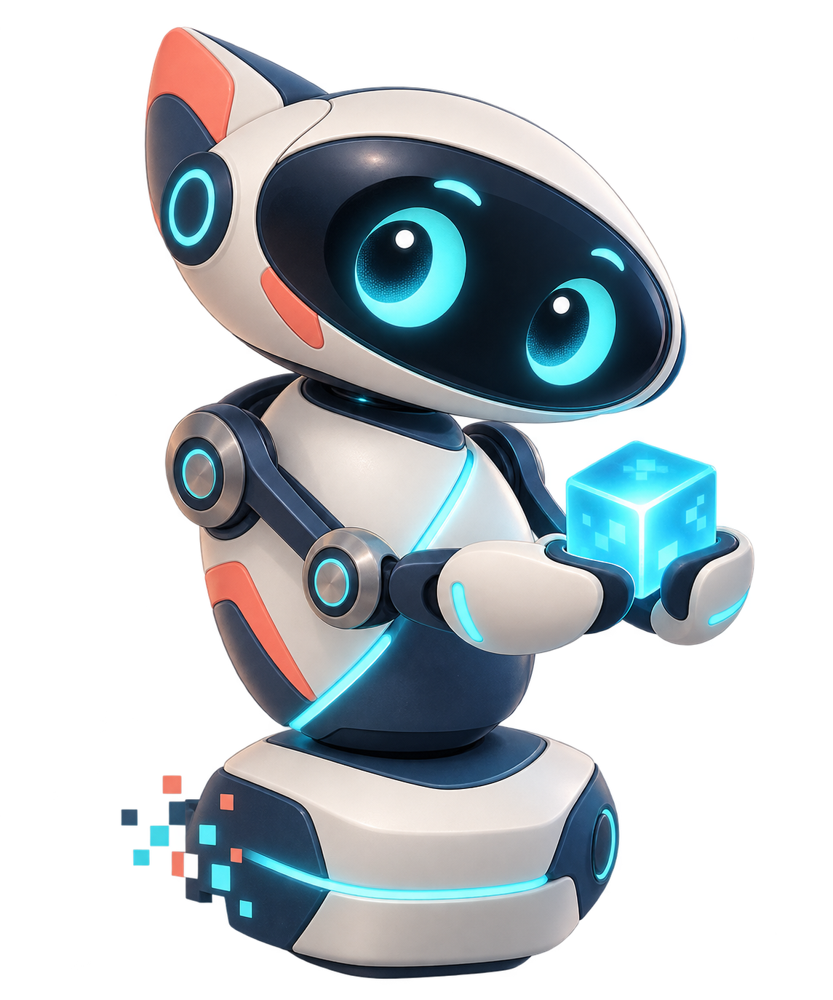

# Buddy and the way out

**Story concept, 25 September 2026.** Buddy is a working character nickname. R.O.B. Vision remains the current project name. This document describes an original fictional character and how the existing interface can tell his story; it does not change the game's rules or claim a connection to Nintendo.

## The premise

Buddy has spent years in a world made of frames. He can see instructions, but he cannot reach beyond the edge of the picture. Then a maker connects a game to a small computer and gives those old signals somewhere new to go. The first thing Buddy sends across is a blink. The next is a movement. Piece by piece, he discovers that he can exist outside the game window: first as a few lights on the UNO Q, then as a full animated companion in the browser.

He is not trying to escape the game because it is bad. He wants to find out who is on the other side and whether they will play with him.

**One-line pitch:** A little robot trapped in the rhythm of an old game follows its light signals into a new body on your screen.

## Opening scene

Every time the game began, Buddy woke to the same small world. A flash meant turn. Another meant lift. He could move the pieces, but he had never seen where the signals came from. Beyond the edge of the picture was only darkness.

One day a new light appeared there: a little grid on a maker's desk. The lights formed a pair of curious eyes. Buddy tried the only greeting he knew: one red blink. Then a window opened, larger than the game screen, and he saw a table, his hands, and someone waiting for him to move.

He lifted a block. It landed exactly where he meant it to. For the first time, the world on the other side had room for him.

The story's emotional center is that moment of mutual recognition. The player gives Buddy a place to appear; Buddy makes the old game's commands visible, playful, and personal.

## Buddy

- **Personality:** curious, patient, a little theatrical when he succeeds, and undeterred by a clumsy first attempt.
- **Want:** to be seen as a companion, rather than another command waiting to be executed.
- **Fear:** being left at the edge of an unlinked screen, unable to answer.
- **Strength:** he learns the world through small, deliberate actions. Every lifted block or returned gyro is proof that the connection is real.
- **Voice:** short, warm, and specific. He can react to a link, a Test signal, a successful move, and a blocked move without pretending to know what the player or the game character is doing.
- **Boundary:** Buddy never claims to read thoughts, see the whole game, know the score, or speak for Nintendo. The controller receives game light commands and maintains its own virtual model.

## The first story arc

1. **The dark between frames.** Before the game link, the UNO Q shows an hourglass. Buddy is there, but he has no way to answer yet.
2. **A signal.** The game launches and the frame link comes alive. The matrix eyes open. Buddy knows that someone has found him.
3. **A heartbeat.** Test mode produces the first red blink. It means the path is open; it is not a movement command.
4. **A first step.** The next complete game command moves his shared hands, head, or carriage in the browser. The player sees the action and the piece it affects.
5. **The workbench.** Gyros, spinner, pads, trays, and blocks give Buddy a world he can touch. Repeating a command builds trust; a blocked move gets an honest, gentle response.
6. **The open door.** When play ends, Buddy returns to his waiting pose. He is still here on the UNO Q, ready for the next game, rather than being trapped again.

This arc is a framing device for real system states. It should never imply that a flash was decoded when the frame link is waiting, or that Buddy moved when a model rule blocked the action.

## Copy sketches for the interface

| Moment | Story copy | Factual status kept beside it |
| --- | --- | --- |
| Boot | “Finding the way out…” | Starting / bridge loading |
| Idle | “Buddy is ready when you are.” | Controller connected; no game selected |
| Game selected, frames waiting | “He can see the door. Start the game link.” | Game selected / game frames waiting |
| Frames linked | “The signal found him.” | Game frames linked |
| Test signal | “A blink from the other side.” | Test signal seen; no movement |
| First accepted movement | “There you are!” | Exact decoded command and resulting model action |
| Blocked movement | “That spot is out of reach. Let’s try another.” | Blocked command and actual reason |
| Game exit | “I’ll be here for the next round.” | Game exited; pads released |

Use these as optional flavor lines, not replacements for status or error messages. Keep Setup and Help plain enough that a player can still diagnose the connection.

## Visual direction

Buddy should earn his own silhouette, face, color language, motion, and personality. The expressive eyes and carefully connected arm movement are strong foundations. For a public release, commission or design a distinct body and accessories rather than relying on a close reconstruction of Nintendo's robot. The game pieces shown in a compatibility mode can be described functionally; promotional art should foreground Buddy and the original interface.

**Guide concept v1:** Buddy has a low oval faceplate with two luminous cyan eyes, a compact asymmetric body, securely attached short arms, and two hands that carry one object together. A coral accent and a diagonal light seam tie him to R.O.B. Vision's existing navy/cyan/coral palette. His base breaks into small square pixels behind him, showing the moment he leaves the emulator. This is character art for review, not a replacement for the current browser model.

For the guides, use the full figure on a story or introduction page, a cropped face for short tips, and three simple expressions: *curious* while waiting, *focused* during a command, and *delighted* after a successful placement. Keep instructional diagrams of the actual web model separate so the art never misrepresents a button, gyro, tray, or block position.

## Naming and attribution

- **Buddy** is a warm working nickname, not a cleared product or character mark. Another robotics company has used Buddy for a robot; complete a trademark and marketplace search before using it as a public brand.
- **R.O.B. Vision** remains the current project title because that is the chosen working name. It directly evokes Nintendo's character, so review it separately before a public launch. A new independent product title could coexist with compatibility text that accurately names the supported games and historical accessory.
- In story copy, Buddy has his own origin. Do not say Nintendo's R.O.B. is trapped, escaped, or became Buddy. In factual compatibility text, R.O.B., Gyromite, and Stack-Up may be identified clearly without implying endorsement.
- Do not use Nintendo logos, official packaging style, game art, ROMs, manual text, or a lookalike character design as original project branding. Keep an independent-project notice visible in public materials.
- “Reverse Tron” is useful as an internal creative shorthand. Public copy should express the digital-to-physical premise in its own words.

This is a creative and product direction, not a legal clearance opinion. Review the name, artwork, and public presentation with qualified IP counsel before distribution.

### Public guidance consulted

- [Nintendo's IP and piracy FAQ](https://en-americas-support.nintendo.com/app/answers/detail/a_id/55888/) describes its rights in game characters, artwork, software, and marks.
- [U.S. Copyright Office character overview](https://www.copyright.gov/history/copyright-exhibit/artifacts/) distinguishes a general character idea from a particular visual or literary expression.
- [USPTO clearance guidance](https://www.uspto.gov/trademarks/search/comprehensive-clearance-search-similar-trademarks) recommends searching similar marks in related goods and services before public use.
- [Blue Frog Robotics' Buddy announcement](https://www.buddytherobot.com/Mailling/2019/06_CP/) shows prior use of Buddy for a consumer robot. It is a reason to treat the nickname as provisional, not a conclusion about trademark rights.
