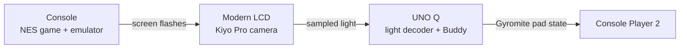
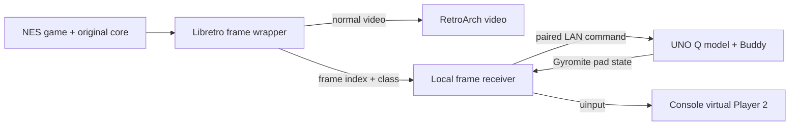

# From light to frames: the R.O.B. Vision engineering journey

R.O.B. Vision began with a camera watching a modern screen, much as Nintendo's original R.O.B. watched a television. The Arduino UNO Q would see Gyromite's and Stack-Up's flashes, decode a command, and move a virtual Buddy on a laptop, tablet, or phone. The idea made the game's light signals visible and meaningful again. It also gave us a hard question: could a practical camera read every short flash reliably enough to play?

This is the record of how we answered that question on the tested UNO Q, Kiyo Pro, LCD, and RetroPie setup in September 2026. It follows the experiments in the order they changed the design. The dated reports linked at the end retain the raw observations; this guide explains the engineering decisions. It is a historical account, not the setup procedure for the current release.

## The original route

The first design put a camera on the UNO Q, aimed at the game display. The game host and UNO Q communicated over the local network. An exact ROM-name registry selected Gyromite or Stack-Up, and the browser showed Buddy, gyros or blocks, and a virtual game table. Gyromite also needed a return path: when Buddy's virtual gyro pressed a coloured pad, a virtual Controller 2 button had to reach the game.

We examined the user-supplied World ROM archives to learn what the light meant. Each movement command is encoded as one 13-frame dark/green sequence. A decoded sequence tells Buddy to move Left or Right, lift or lower his arms, or Open or Close his hands. The two games share Left, Right, Open, and Close; their Up and Down sequences differ. A separate ready-light sequence carries status rather than movement. The static analysis identified the program tables and palette choices behind these flashes. That let the decoder require an **exact, game-appropriate complete sequence** rather than guessing a movement from brightness. The [ROM analysis](ROM_SIGNAL_ANALYSIS.md) preserves the hashes, CPU addresses, and patterns.

## The first warning: simulated timing

Before the camera was attached, synthetic light traces exercised the decoder and virtual model. At the high diagnostic rate of 240 frames per second, the initial run decoded all 900 tested transmissions. That rate was not available from the intended camera. A later, more relevant 30/60 fps stress test showed why the target mattered: at 30 fps, none of 900 transmissions were accepted. At 60 fps, the original decoder accepted 839 of 900 but occasionally chose the wrong command. An ambiguity guard then accepted 667 of 900 correctly, rejected 233, and made no wrong choice in that run or ten additional seeded runs.

Those are **simulations**, not observed camera reliability. They established a safety rule: rejecting a missed command is preferable to moving Buddy in the wrong direction. They also suggested that a camera delivering about 60 fps could miss a one-frame light cell when its sampling phase differs from the game's roughly 60 Hz output. The [unattended test report](UNATTENDED_TEST_REPORT_2026-09-24.md) records the seeds, counts, and limits.

## What the Kiyo Pro actually saw

On the UNO Q, the Kiyo Pro initially delivered about 30 fps in the default path. Disabling HDR temporarily and selecting 640-by-480 MJPEG raised measured delivery to about 60 fps. The camera watched a modern LCD while RetroPie ran the games. We adjusted exposure, aimed and re-centred the camera, and saved a small sampling region on the display. These were measurements of delivered frames, not promises from a camera mode label.

The camera recognised useful **status** signals. Gyromite's Test screen produced a sustained green field; Stack-Up's Test screen produced an alternating light signal. Both could blink Buddy's red Test light without moving him. That proved the camera could see broad changes. It did not prove it could recover every short cell of a movement word.

Gyromite Direct mode initially produced no decoded robot actions from six spaced commands. Stack-Up offered partial success: one live UP/RIGHT sequence decoded both commands, with UP correctly blocked at the model's upper limit and RIGHT moving the virtual station. A later DOWN command also decoded and lowered the arm. But four further hands-free UP/RIGHT cycles produced bright camera samples and **zero** complete commands. The virtual model stayed still, as its strict decoder required. These are genuine successes and failures from the same physical route; the successes were not a reliable play rate.

## Looking harder at the picture

We tested whether the missing information was elsewhere in the camera image. Moving the camera closer and straight on improved framing. A small dark patch, a wider screen average, and horizontal bands were recorded side by side. RetroArch simultaneously recorded the game's rendered frames, giving each camera trace a known source word. The wide average generally missed the same cells as the small patch. One band recovered UP in offline replay, but later cycles still yielded no complete command from any band.

The apparent "missing ninth bit" was not one fixed defect. Source recordings contained exact UP, LEFT, DOWN, RIGHT, and OPEN words. Some camera traces preserved the distinguishing ninth cell yet still failed timing validation; other traces blended or missed different cells. UP and RIGHT can differ at only one cell. Accepting the nearest pattern would have risked a wrong turn.

We then used the Kiyo Pro's uncompressed modes. A 1280-by-720 YUYV run delivered about 60 fps but decoded LEFT while missing both UP commands in a source-recorded UP/LEFT/UP sequence. Raw 1920-by-1080 NV12, without full colour conversion, also delivered near 60 fps. We sampled three narrow strips and 24 row bands in each. In the normal framing, the frame average matched two of four source-recorded commands; zoom and tilt matched one of four. For the remaining commands, **none of the 72 row regions** recovered an exact word. The camera's UVC metadata gave finer timing records, but timestamps could not recreate a light cell absent from the captured pixels.

These results apply to the tested camera, display, framing, and modes. They do not prove a camera can never decode R.O.B. flashes. They do show that more pixels, rows, zoom, and timing metadata did not make this setup dependable. The [live optical report](LIVE_OPTICAL_TEST_2026-09-25.md) and [raw-row report](KIYO_PRO_ROW_TEST_2026-09-25.md) keep the source-aligned comparisons.

## The turning point: read the frames before the display

The source recordings repeatedly showed full 13-frame words even when the camera trace did not. The game had emitted the command; the information was being lost between emulator output, LCD presentation, and camera capture. That observation changed the input boundary. Instead of looking at the display after it was filmed, we could observe each rendered NES frame inside RetroArch.

The first FCEUmm integration used a small libretro wrapper. It forwards the original core's calls and video to RetroArch, classifies each rendered frame as dark, green, or other, and sends the frame number and class to a local Unix socket. The console receiver verifies the sending RetroArch process, wrapper path, and exact ROM identity. Only a complete 13-frame word is sent over the paired network link to the UNO Q. The same virtual model still decides whether a movement is valid, and Gyromite's virtual pad still returns through Player 2.

This is still decoding the game's **rendered light message**. The wrapper does not read a hidden game action, inspect level memory, modify a ROM, or replace the original emulator core. It observes the signal at a point where each emulated frame is available once. That removes camera and display sampling from the command path while keeping the ROM-derived words and fail-closed decoder.

## Proving the new route

The first live FCEUmm Direct-mode sessions produced all six movement command types in **both** games. The receiver recorded exact words and frame numbers; the UNO Q applied valid movements and reported boundary blocks. Idle and Test-only frames caused no unintended motion in those sessions. The [FCEUmm frame-link report](FRAME_LINK_TEST_2026-09-25.md) preserves the observations.

Nestopia was the next breadth test. The same wrapper design loaded its original core and delivered Stack-Up and Gyromite movement words through normal RetroPie launches. Gyromite's Player 2 return path needed a separate correction: Nestopia treated device `1` as Auto and selected its optical peripheral, so the wrapper now selects explicit gamepad device `257` after ROM load. Live Game A recordings then showed the blue gate move during a blue hold, return on release, and remain still during a red-only hold. The fix was checked on RetroPie and the supported Batocera host. The [Nestopia report](NESTOPIA_FRAME_LINK_TEST_2026-09-25.md) records that sequence.

Once frame input could also recognise Test light, the camera runtime, OpenCV dependency, camera controls, and recovery helpers were removed from the release path. The Test light and UNO Q matrix cues now follow the authenticated frame link. The virtual character and browser art did not need a new concept; only the source of the light signal changed. The [current technical reference](TECHNICAL_ARCHITECTURE.md) describes that installed design.

## What the journey established

| Question | Evidence-based answer |
| --- | --- |
| Could the camera see the games' light? | Yes. Both Test signals and some live Stack-Up movement words were recognised. |
| Was this Kiyo Pro/LCD path ready for autonomous play? | No. Repeated commands were missed, including after re-centring, uncompressed capture, row sampling, and zoom. |
| Was the ninth cell always missing? | No. Source-aligned traces showed different losses and timing failures. |
| Why keep exact matching? | A one-cell error can turn one command into another. Rejection protected the virtual model from false movement. |
| What did the libretro wrapper change? | It observed each rendered NES frame before the display and camera path, then used the same game-specific word decoder. |
| What remains to study? | Long sessions, Stack-Up Memory/Bingo behaviour, and other hardware or emulator integrations need their own evidence. |

The result was not that the camera idea was foolish or that a camera can never work. It was that **this measured camera/display route was not reliable enough for the game we wanted to play**. The libretro frame link preserved the original light language and made Buddy respond consistently on the verified console paths. The camera experiments remain valuable history and a starting point for anyone who later wants to investigate physical optical play.
