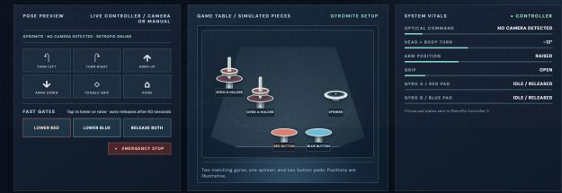

# R.O.B. Vision gameplay guide

The UNO Q owns Buddy's pose, gyros, spinner, pads, trays, and blocks and updates the browser. A paired RetroPie or supported Batocera console sends complete game-frame commands. Gyromite's pad states return to that console's virtual Controller 2. For dated live test evidence, see the [release validation report](RELEASE_VALIDATION_0.1.0.md).

## Gyromite

The [original Gyromite booklet](https://www.digitpress.com/library/manuals/nes/gyromite.txt) describes **Test**, **Direct**, **Game A**, and **Game B**. Direct sends six R.O.B. actions: up, down, left, right, open, and close. In Game A, Start switches into the robot-transmission screen for a command and then back to the professor. In Game B, the professor walks while Controller 1 directly commands R.O.B. A gyro on the blue or red tray lowers the matching gate.

The manual explicitly says a gyro **does not need to spin to operate only one gate**. R.O.B. can hold an unspun gyro on the virtual pad, then lift it to release that pad. If both gates must be controlled, spinning one gyro lets it stay upright on one pad while R.O.B. uses his hands to put the other on the other pad. A gyro that is no longer needed belongs on its holder. The spinner is a means to free R.O.B.'s hands, not an obligatory step for every pad press.

**Available preview:** the finite Gyromite demo shows an unspun held press, a two-gyro spin relay, separate spin-down and one recovery for each gyro, then a tidy return to both holders. It stops at `COMPLETE`. The spin lifetime is illustrative. Select **Home** to reset. In the connected setup, UNO Q pad state reaches the active console's virtual Controller 2; the browser's local-only preview does not drive that receiver.

**Live controller:** the UNO Q maintains the locations and spin phases of Gyro A and B. It derives red and blue virtual button states from those modeled conditions and sends them over LAN to the active console's Controller 2 receiver. It releases both buttons on game exit, connection loss, stale packets, or mode change. The **Fast Gates** dashboard controls place or return the matching virtual gyro and send the pad state immediately, with a 60-second automatic release. This keeps gate operation responsive while the player moves Hector. The console frame link controls R.O.B.'s virtual actions from complete rendered-frame commands; the launch hook supplies the game ID. The controller keeps game context and modeled piece state distinct from unknown on-screen professor or gate positions.

*Pose Preview, Game Table, and System Vitals in the local Gyromite preview. Fast Gates appear during live Gyromite play.*

## Stack-Up

The [Stack-Up booklet](https://www.digitpress.com/library/manuals/nes/Stack-up.pdf) describes Direct, Memory, and Bingo. The virtual fixture has five numbered trays and five colored blocks. Direct and Memory start with all five on Tray 3, top to bottom **red, white, blue, yellow, green**. One-player Bingo historically uses any color order on Tray 3; two-player Bingo starts with three on Tray 3 and one each on Trays 2 and 4. The current live model initializes the Direct/Memory stack for all modes; Bingo-specific layouts are not implemented. Direct moves Professor Hector onto six command keys: **left, right, up, down, open, close**. Memory plays a programmed command series; Bingo sends a command when one row or column completes. The UNO Q code applies each validated game-frame command as one virtual action; all six command types were observed through a live console frame link. It must model the grippers' height, so R.O.B. can carry a block together with all blocks above it. Stack-Up's documented modes do not need Gyromite's virtual Controller 2 pad return path, even though two-player Bingo uses a second human controller.

**Available preview:** R.O.B. first moves red alone from Tray 3 to Tray 4, then grips blue and white together and carries both to Tray 2. Green and yellow remain on Tray 3. All five blocks appear in the Live Model, Accessory Bay, and Game Table as they move. The **Stack-Up Commands** buttons above System Vitals apply one virtual left, right, up, down, open, or close action. **Home** restores the starting stack. A blocked move leaves all blocks in place and explains why. The preview demo is scripted; the separate live controller accepts manual commands and complete game-frame detections from the active console. In game play, the player compares the virtual arrangement with the target shown by the game. The flash stream does not tell the controller which block to move or whether the target was achieved.

## Pose Lab and recovery

Pose Lab exercises R.O.B.'s head, body turn, arms, and paired grip without game pieces or commands. Its demo is a short greeting; the controls below the scene let the viewer try poses manually. It is an art and motion sandbox, not a third game. In a live session, unreadable flashes produce no movement. A browser reconnect receives the UNO Q's current snapshot; it never restarts an action. If the Gyromite return path disconnects, virtual Controller 2 buttons release even if the browser still shows a gyro on a pad. The game host receives controller states, not a proof that a level was completed.
