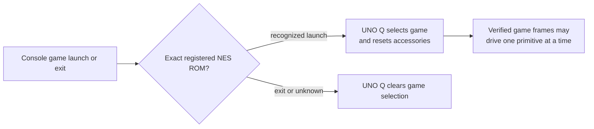

# Game identification from console launch events

R.O.B. Vision selects Gyromite or Stack-Up from the exact filename launched by a paired RetroPie or supported Batocera console. Launch identity supplies game context; game-frame decoding supplies movement. An unknown title clears the selected game.

## Registry and launch path

The [registry](../config/games.json) lists accepted case-insensitive ROM basenames, including configured `.nes`, `.zip`, and `.7z` names. The resolver accepts NES/Famicom launch metadata, while the installed emulator frame integration and ROM directories are for NES. A renamed archive needs an explicit registry entry. After pairing, select **Edit ROMs** beside that console in Setup, add the exact launched filename with the value `gyromite` or `stack_up`, validate, and save. Exit a running game before saving; launch it again to use the new mapping. Each paired console has its own file, and upgrades keep its edits. ROM files and extracted game graphics are never installed with R.O.B. Vision.

RetroPie uses runcommand launch/end hooks. The installer preserves existing hook behaviour and adds the R.O.B. Vision notifier and receiver. Supported Batocera uses its separate `zz-robvision-game` launch hook. The notifier sends a paired, authenticated game event to the UNO Q; the frame receiver also checks the exact ROM identity before forwarding a decoded command. A launch event alone never moves Buddy.



On RetroPie, the receiver scans the running RetroArch process and can resend game identity after a UNO Q restart. Both consoles identify themselves in launch events, receiver heartbeats, and frame commands. When two consoles are paired, only the active game's console may drive the model. Game exit releases Gyromite's virtual buttons.

## Check the resolver

The [resolver](../tools/identify_game.py) accepts the launch arguments supplied by RetroPie. For local inspection:

```sh
python3 tools/identify_game.py start nes lr-fceumm "/roms/nes/Gyromite (World).zip" ""
python3 tools/identify_game.py start nes lr-fceumm "/roms/nes/Stack-Up (World).7z" ""
python3 tools/identify_game.py end
```

These return `gyromite`, `stack_up`, and `idle`. Use the launched archive filename, not its inner `.nes` member unless that file is actually launched. For live verification, launch each game from the console menu, check the game name and **GAME FRAMES LINKED** on Mission, then exit and confirm the selection clears. See the [release validation report](RELEASE_VALIDATION_0.1.0.md) for dated results and [technical architecture](TECHNICAL_ARCHITECTURE.md) for the trust boundary.
