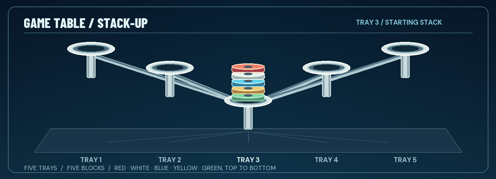

# Play Gyromite and Stack-Up with Buddy

The UNO Q receives complete movement commands from a supported game's rendered NES frames. Buddy acts on those commands in the browser; the game continues on your console screen. Keep Mission open on a laptop, tablet, or phone to see Buddy, the accessories, and the Game Table. The console game remains the source for Hector's position, goals, and score.

## Before you play

Pair your console in Setup, then launch an exact registered Gyromite or Stack-Up ROM through a R.O.B. Vision core. Mission and Setup should show **GAME FRAMES LINKED**. When a game enters Test mode, Buddy's red light blinks and the UNO Q matrix shows **T**; Test is a link check, not a movement. A ready-light command gives a brief steady red light.

With no supported game active, choose a game on Mission and run its finite **Demo Sequence**. The demo also works while a console is paired but idle. Choose **Home** to restore the starting pose and pieces. During live play, Buddy follows the game's commands; the manual controls are useful for checks and recovery.

## Gyromite: two gates and two gyros

Gyromite gives Buddy two gyros, two holders, one spinner, and red and blue pads. A gyro pressing a colored pad lowers the matching gate through the console's virtual Controller 2. Buddy can hold an **unspun** gyro on one pad, then lift it to release that gate. A **spinning** gyro can remain upright on one pad while Buddy moves the second gyro to the other. He returns a gyro to its holder when it is no longer needed. Spin duration in the virtual model is illustrative.

Buddy has six vertical levels, with Home at the top, level 6. Gyromite's Up and Down commands move two levels at a time: two Down commands from Home pass through level 4 and reach level 2, where his hands meet either holder, the spinner, and both pads. Raise a carried gyro once to level 4 before turning; level 6 gives more clearance. This level-2 working height is our virtual scene's alignment, not a numbered accessory height from Nintendo's manual. The manual's positions 1–5 are slots around R.O.B.'s base: spinner at 1, button tray at 2–3, and holders at 4–5. A gyro presses a button by resting on its colored tray; lifting it releases the button. The accessories appear at different heights on screen because the table is shown in perspective.

| Mode | What to expect |
| --- | --- |
| Test | The game's Test signal blinks Buddy's red light. It does not move him. |
| Direct | Complete Up, Down, Left, Right, Open, and Close words move Buddy directly. |
| Game A | You control Hector; Start switches to the robot-transmission screen for a command and then back. The game screen shows Hector and the gates. |
| Game B | Hector walks while Controller 1 commands Buddy. Virtual pad states still return through Controller 2. |

**Fast Gates** gives an immediate check during live Gyromite: choose **Lower Blue** or **Lower Red** to press that pad, choose it again to release, or choose **Release Both**. Keyboard shortcuts are `2` for blue, `1` for red, and `0` to release both. A hold expires after 60 seconds. If you previously moved a gyro with normal controls, choose **Home** before using Fast Gates. On game exit or lost link, both pad states release.

## Stack-Up: five trays and five blocks

Stack-Up has five colored blocks and five trays around Buddy. Direct and Memory begin with every block on **Tray 3**, top to bottom: **red, white, blue, yellow, green**. Buddy's station can move among the trays, and his hands can move among six height levels. Closing on a lower block can pick up that block and every block above it as one ordered group. Opening places the group without changing its color order.

In Direct mode, guide Hector onto the game's **Left, Right, Up, Down, Open,** or **Close** key. Each complete flashed word applies one virtual action. The Game Piece card highlights the block Buddy can pick up or the group he carries. Watch the Live Model and Game Table as he moves. A blocked pickup, out-of-range move, or invalid placement leaves the blocks where they were and explains the reason in the Activity Feed.

Memory sends a programmed command series; Bingo sends a command when a row or column is completed. Buddy follows the movement words, but the current model starts with the Direct/Memory Tray 3 stack in every mode. Bingo's different starting arrangements are not modeled. The game does not transmit a block color, target tray, target arrangement, score, or round result. Compare the virtual arrangement with the target on your console screen. Stack-Up has no Gyromite gate-button return path.

*Illustration of the current Game Table's starting arrangement. The block order and tray positions come from the dashboard model.*

## Recover and keep playing

If Mission reconnects during play, it resumes the UNO Q's current state. **Home** restores the selected game's virtual starting pose and pieces. **Emergency Stop** clears a live selection or cancels an offline preview animation. In Gyromite, release both Fast Gates before resetting. For a missing action, check **GAME FRAMES LINKED** and the Activity Feed; a command can be decoded correctly yet blocked by the virtual model's position or grip rule.

The [Installation & Setup Guide](INSTALLATION_AND_SETUP.md) covers pairing and core selection. The [Technical Reference](TECHNICAL_ARCHITECTURE.md) describes the command words and model rules. Gyromite and Stack-Up are named for game compatibility; Buddy and this guide are independent project work.
