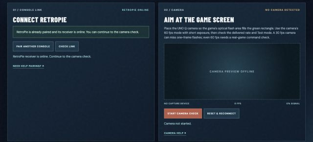

# R.O.B. Vision installation guide

**Installed test setup, 25 September 2026:** R.O.B. Vision is a separate UNO Q App Lab app. `retropie.local` has exact-name runcommand hooks, pairing, and a virtual Controller 2 receiver. Gyromite launch/exit and both gate colors have been verified under FCEUmm. The UNO Q camera recognized both games' Test signals; camera-only movement remains intermittent. FCEUmm drove all six commands in both games through the frame link. Nestopia's frame link is installed and delivered live movement commands from both games to the UNO Q; its Gyromite Player 2 gate return remains to be checked. There is no physical robot to assemble.

## UNO Q and browser

Start **R.O.B. Vision** under App Lab **My Apps**. This UNO Q runs one App Lab app at a time, so stop VirtualGlove first. App Lab exposes port 80 at `http://arduiain.local/dashboard/` and the controller directly at `http://arduiain.local:8766/dashboard/`. Both use one virtual game state. The App Lab Python image includes OpenCV; its `python/main.py` gateway talks to `controller/service.py`, and Router Bridge talks to the matrix sketch. Existing Avahi supplies the `.local` hostname. Do not enable the separate `deploy/rob-vision.service` while App Lab uses port 8766.

Open [Setup](../dashboard/setup.html) to check pairing and frame a camera. Browser controls are available on the trusted LAN without a token prompt. The token in the UNO Q's `~/.config/rob-vision/environment` is for RetroPie launch and receiver identity. Keep the LAN private. A local `file://` copy is the independent preview; use the UNO Q URL for live status.

## RetroPie

See [RetroPie deployment instructions](../deploy/retropie/README.md) for hook files, root uinput receiver service, pairing, both FCEUmm and Nestopia frame-link choices, and RetroArch port 2 configuration. The current test machine already has these installed. On another machine, merge launch/end hooks with any existing custom scripts, then pair from the Setup page. **Check Link** becomes online after authenticated receiver polls. The receiver also scans the active RetroArch process so it can resync game context after a UNO Q restart.

For either supported game, choose `lr-robvision-fceumm` or `lr-robvision-nestopia` in RetroPie's emulator selection to keep automatic game-frame movement. These entries run the installed FCEUmm or Nestopia core through the R.O.B. Vision frame wrapper; they are not separate emulators. Choosing the plain `lr-fceumm` or `lr-nestopia` entry runs the game without that frame link. The UNO Q camera and manual controls are separate input paths.

## Camera commissioning

Attach a compatible camera to the UNO Q, aim it at the game's optical flash region, and use Setup's **Start Camera Check**. Confirm that OpenCV found a real capture device, the green crop covers the flashing region, and measured fps is near 60. Test both games' Test mode, then record complete valid commands and false-trigger behavior on the intended screen. The current service asks for 60 fps and uses the center 60% crop by default. Even delivered 60 fps does not guarantee every one-frame flash; at 30 fps the synthetic decoder rejected them. The installed RetroPie FCEUmm and Nestopia frame-link choices read each rendered NES frame and handle automatic game commands without depending on the camera. Both delivered live commands from Gyromite and Stack-Up. Camera-only play remains experimental.

**Reset & Reconnect** retries capture in software. UNO Q camera-recovery, shutdown, early-start, and network-status host helpers are included in [deploy/uno-q](../deploy/uno-q/README.md), but are not installed by App Lab and need privileged host setup. The existing Ethernet adapter shares the USB hub, so the recovery helper guards against resetting a hub carrying network traffic.

## Local development trial

From the repository, install `requirements-camera.txt` if camera capture is needed, run `python3 -m controller.service`, and open `http://127.0.0.1:8766/dashboard/`. For LAN access use `ROB_VISION_TOKEN` and `--host 0.0.0.0`; the token remains for RetroPie operations, while trusted-LAN browser controls are open. Use `--camera-index` and `--camera-roi x,y,width,height` for a chosen camera/crop. The static preview can be served with `python3 -m http.server 8000` and has no game link.

Run the [verification plan](VERIFICATION_PLAN.md) before treating optical play as complete.
