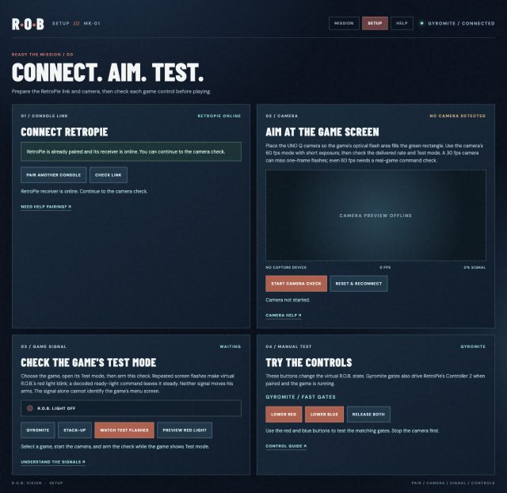

# R.O.B. Vision Setup

Open `http://arduiain.local/dashboard/setup.html`. It opens directly to the RetroPie link status. If the receiver is already online, no pairing step is needed. Setup has four checks:

*The Setup layout; this screenshot predates the connected camera test.*

1. **Pair RetroPie.** The receiver and launch hooks must already be installed on RetroPie. Run `python3 /home/pi/rob-vision/tools/retropie_pair.py` in a RetroPie terminal. For five minutes it shows a six-digit code and a SHA-256 fingerprint. Enter its hostname, code, and fingerprint on Setup, then select **Pair Console**. The UNO Q checks the console certificate fingerprint before sending its token over the encrypted pairing connection. The one-time process writes the token to `/home/pi/.config/rob-vision/token` with owner-only permissions and attempts to restart the receiver. **Check Link** shows online when the receiver's authenticated polls reach the UNO Q; it turns offline after three seconds without a poll. Pairing supplies the token to an already prepared receiver; it does not install RetroArch mappings or hooks.
2. **Aim the camera.** Attach the camera to the UNO Q and select **Start Camera Check**. The live image shows the green sampling rectangle. Point it at the game's flashing area and check the delivered frame rate and signal level. If the camera disconnects or stops delivering frames, reconnect the cable and select **Reset & Reconnect**; this closes the old capture, scans devices again, and restarts the camera in software. It does not reset the shared USB hub. Select **Stop Camera Check** before manual Gyromite gate tests. The attached Kiyo Pro delivered about 60 fps at 640×480 after its temporary HDR-off setting was applied. Both games' Test signals were recognized with a tight crop, but movement commands have not decoded from the live screen.
3. **Check Test mode.** Select Gyromite or Stack-Up and enter that game's Test mode. With the camera running, select **Watch Test Signal**. Gyromite's sustained green field or Stack-Up's alternating green/white Test signal makes the virtual R.O.B.'s red head light blink on Setup and Mission. A separately decoded ready-light command makes it glow steadily. Neither moves his arms or game pieces. **Preview Red Light** shows the blinking animation for a few seconds without claiming a camera signal was detected. If the page stays on *Watching*, adjust the camera and retry. The [Gyromite manual](https://www.digitpress.com/library/manuals/nes/gyromite.txt) and [Stack-Up manual](https://www.digitpress.com/library/manuals/nes/Stack-up.pdf) describe Test mode for adjusting R.O.B. to the screen. Both Test modes have been confirmed with the attached camera. In Stack-Up, press Select at the ROBOT BLOCK artwork to show the mode list, choose Test, then press Start. The Test signal appears over the ROBOT BLOCK artwork. Movement commands remain unverified.
4. **Try the controls.** For Gyromite, **Lower Red** and **Lower Blue** press the matching virtual pads immediately; select the same control again to raise it or **Release Both**. The automatic 60-second release still applies. For Stack-Up, **Left, Right, Up, Down, Open, Close** send one manual command to the virtual model. Stack-Up has no Gyromite-style Controller 2 pad return path. Check the Mission page's Live Model and Game Table for the resulting movement.

A local `file://` Setup page is only a preview; use the UNO Q URL for live status. Setup shows delivered fps averaged over four seconds. Movement commands remain unverified on the actual display.

The Mission page keeps Fast Gates for responsive play. Its Game Table now sits beside Pose Preview and System Vitals. The camera image appears only on Setup.
