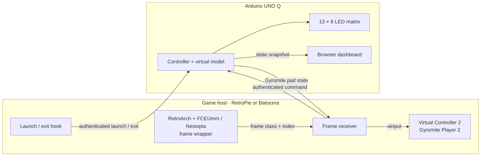

# R.O.B. Vision technical reference

This is the implementation reference for the 0.1.x system. The Arduino UNO Q owns Buddy's virtual pose and pieces. RetroPie or supported Batocera runs Gyromite or Stack-Up. A browser on a laptop, tablet, or phone renders the controller's state. Automatic commands come from emulator-rendered NES frames; the current application has no camera input path.

## System and responsibilities

| Component | Responsibility | Source |
| --- | --- | --- |
| Game registry | Exact supported ROM basenames and game IDs | `config/games.json`, `tools/identify_game.py` |
| Console launch hook | Start/end events; never robot motion | RetroPie runcommand hooks or Batocera `zz-robvision-game`; `tools/notify_game.py` |
| Core wrapper | Classify each emulated NES video frame and pass the original video onward | `deploy/retropie/rob_vision_fceumm_proxy.c` |
| Console receiver | Check sender, decode commands, report heartbeats, drive virtual Player 2 | `tools/retropie_frame_hook.py`, `tools/retropie_controller2.py` |
| UNO Q controller | Game selection, virtual model, pairing, snapshot API | `controller/service.py`, `controller/model.py`, `controller/pairings.py` |
| UNO Q presentation | Port-80 gateway, LED matrix, browser views | `python/main.py`, `controller/matrix.py`, `sketch/sketch.ino`, `dashboard/` |

The UNO Q is the source of truth for game, pose, pieces, and buttons. The browser polls and animates that state; it does not decode game frames. A directly opened `file://` dashboard is an independent scripted preview, not the live controller.

## Game identity and session lifecycle

The registry matches exact, case-insensitive `Gyromite (World)` and `Stack-Up (World)` basenames with `.nes`, `.zip`, or `.7z` extensions. The resolver accepts NES/Famicom metadata, but the installed frame integration and ROM directories are for **NES**. A renamed archive needs a registry entry. The launched archive name matters, not the name inside it. No ROMs or extracted game art ship with the project.

1. A console hook posts a credentialed `start` event with the system and filename to `/api/launch`. The UNO Q resolves it and initializes the matching game's virtual pieces. An unknown title clears the game.
2. The selected R.O.B. Vision wrapper delegates libretro calls to the installed original FCEUmm or Nestopia core and observes video frames. A plain core can play the game but does not provide the frame link.
3. The receiver accepts frames only from an approved wrapper running a registered ROM. It decodes a complete command before posting it to the UNO Q. A launch event alone never moves Buddy.
4. The receiver polls the UNO Q and drives its virtual Controller 2 only while Gyromite is the active RetroArch process. Stack-Up has no controller-return buttons.
5. An end event clears the selected game. The receiver releases the pad. Its RetroArch scan can replay a recognized launch after a UNO Q restart, with retries throttled to two seconds.

The latest authenticated console launch selects the active game and console. While that ownership remains, a different console's frame command is rejected. A manual browser game selection clears console ownership and remains unowned until another authenticated launch. Removing the active console's pairing clears its session. When idle, an online receiver label may refer to either paired console; it is not evidence of a running game.

## Frame classification and command protocol

The wrapper intercepts the libretro video callback, classifies the frame, and then forwards the video to RetroArch. It samples a 5-by-5 grid plus nine central picture points. Near-black pixels count as dark; a green-dominant pixel counts as light. A frame is `0` with at least 23 dark grid points, `1` with at least 23 green grid points or eight green central points, and `N` otherwise. The central sample handles dark borders on Test artwork. These are **emulated frames**, so monitor refresh and camera frame rate are outside the input path.

Each nonblocking Unix datagram is five bytes: a native 32-bit frame index and ASCII `0`, `1`, or `N`. It goes to `/run/rob-vision/frames.sock`. The receiver uses Unix process credentials, RetroArch's command line, an approved wrapper path, and exact ROM identity to authenticate the local sender; it rechecks the process at least every half second. A new sender or game resets the decoder.

Both games encode one primitive per 13-frame word, `000101w1x1y1z`, with four variable bits. Stack-Up schedules an extra dark frame after the data word. The [ROM analysis](ROM_SIGNAL_ANALYSIS.md) has the examined ROM hashes, CPU addresses, palette proof, and reproducible analysis command.

The inspected Gyromite image has SHA-256 `bf1b323ba39c84b964f93127598b267ff3f16cbf99c533ae1e9b8332232b3e5b`; Stack-Up has `3ab6bc99246783a6bf7083481027fe358ccdb147dcf1165eaf08aaf4e1b06548`. Both are iNES mapper-0 images with 32 KiB program and 8 KiB character ROM. Gyromite's palette-choice table at CPU `$A6FC` supplies 13 entries per populated command slot; its routine at `$A679-$A697` reads them in reverse order. Stack-Up's sender at `$B1DE-$B237` uses the template at `$B24A`. Palette lookups tie the extracted bits to black and green screen frames. These addresses and hashes identify the examined ROM variants, not every regional or patched copy.

| Primitive | Gyromite word | Stack-Up word | Model effect |
| --- | --- | --- | --- |
| Open | `0001011101110` | Same | Open hands; release a held piece if placement is valid |
| Close | `0001010111110` | Same | Close hands; possibly pick up a piece or block segment |
| Left | `0001010111010` | Same | Turn one station left |
| Right | `0001011101010` | Same | Turn one station right |
| Up | `0001010111011` | `0001011111010` | Gyromite: two levels; Stack-Up: one |
| Down | `0001011111011` | `0001010101110` | Gyromite: two levels; Stack-Up: one |
| Ready light | `0001011101011` | Same | Brief status light; no movement |

`ExactFrameDecoder` requires consecutive frame indices and a complete word allowed for the selected game. A gap, `N` in the candidate, wrong Up/Down code, or incomplete word does nothing. Separate identical complete words are valid. The receiver has a bounded pending queue and briefly retries HTTP delivery; it drops a pending item after one second or when the game/source changes. The UNO Q deduplicates retained retries by sender PID and ending frame index, keeping the last 128 keys. It also rechecks game, pattern, PID, index, and active console. This prevents an ordinary retry from repeating motion; it is not a durable exactly-once guarantee across restarts.

Test detection is separate from command decoding. At least 36 consecutive green frames or 12 alternating edges mark a Test field. A recent authenticated heartbeat pulses the Test light. A complete ready-light word lights it steadily for at most one second. Neither changes pose or pieces. The signal does not reveal the game's menu state through memory.

## Virtual model

`GET /api/state` returns schema 1 with `game`, `robot`, `events`, `input`, `test`, and `link`. The UNO Q keeps a sequence number and the latest 30 display events, not a durable event log. Browsers poll every 500 ms. A refresh reads the current snapshot. A fresh `input.frame_hook` means matching game frames recently reached the receiver; it does not prove that the game gate moved or a Stack-Up objective was completed.

### Gyromite

The model tracks two gyros, six height levels, grip, held gyro, spin deadlines, and manual Gate Assist deadlines across five ordered stations: holder B, holder A, red pad, blue pad, spinner. Home is level 6. Gyromite Up/Down moves two levels, so game commands reach levels 6, 4, and 2; all five accessories meet the hands at level 2 in the virtual model. The original manual's positions 1–5 are horizontal base slots, not vertical levels. Their different screen heights are perspective. A carried gyro must rise to at least level 4 before turning; level 6 remains available for greater clearance. This is a virtual collision rule rather than a numbered rule from the original manual. Stack-Up Up/Down moves one level and uses all six positions. Placing a gyro on the spinner starts an illustrative 55-second spin clock. A spinning gyro resting on a colored pad presses its button. A held gyro at a colored pad at level 2 may press it without spinning; lifting it releases the button. The controller does not measure physical spin or inspect gate pixels.

Fast Gates is a manual browser control. It temporarily puts an available gyro on a pad and holds that button for at most 60 seconds, then returns the gyro to its holder on release or timeout. Game-frame movement is rejected while Gate Assist is held. Red and blue are independent. Selecting a game or Home rebuilds the pieces; Emergency Stop selects no game.

### Stack-Up

The model tracks five trays, five distinct blocks, six height levels, one station, and one grip. It starts all blocks on Tray 3, bottom to top green, yellow, blue, white, red. Left/Right moves one tray; Up/Down moves one level. Closing at a block height lifts that block and everything above it as an ordered segment. A carried segment must clear another tray; release requires the next free level. Invalid moves leave pieces in place, and a conservation check rejects loss or duplication.

Direct, Memory, and Bingo transmit the same six movement primitives. The controller does not receive target pattern, score, or victory state. It currently uses one starting arrangement; distinct mode-specific historical layouts and extended Memory/Bingo play are outside the verified model claim.

## Gyromite return path

The console receiver creates a Linux `/dev/uinput` pad named `R.O.B. Vision Controller 2`. It polls the UNO Q every 50 ms with a 250 ms request timeout, validates schema 1, and emits changed red/blue states with a sync event. It releases both when Gyromite is not the active RetroArch process, the paired source is not selected, or no good response arrives for 750 ms. Exit and service shutdown also release them.

| Runtime setting | Current value | Owner |
| --- | --- | --- |
| Browser snapshot poll | 500 ms | `dashboard/live.js` |
| Receiver poll / HTTP timeout / stale pad release | 50 / 250 / 750 ms | `tools/retropie_controller2.py` |
| RetroArch process scan / launch replay throttle | 250 ms / 2 s | `tools/retropie_controller2.py` |
| Frame-link freshness / receiver-online freshness | 1 s / 3 s | `controller/service.py` |
| Recent event history / retry keys | 30 events / 128 keys | `controller/service.py` |
| Gyro spin / manual gate maximum | 55 / 60 s | `controller/model.py` |
| Game registry | Installed `config/games.json` on each console | Console receiver; UNO Q trusts its authenticated game assertion |
| Console registry and Router editor | HTTP port 8769 | Paired console, proxied through UNO Q Setup |
| Frame socket | `/run/rob-vision/frames.sock` | Console receiver |

Controller Router is packaged with R.O.B. Vision. Its config schema is shared with VirtualGlove: existing Player 1-4 assignments are preserved, and Buddy is added as a Player 2 source. On a fresh console, configured EmulationStation controllers seed the corresponding player slots. The Setup Router editor can reassign physical sources and tests button activity. The raw Buddy pad has a fixed two-button Linux mapping; the receiver swaps red and blue before Router translates them into canonical merged A/B buttons. The receiver and wrapped-game launch hooks never write RetroArch port assignments.

The routing engine is now the vendored `router_shared` package from the separate Controller Router library, with identical source in R.O.B. Vision and VirtualGlove. It owns controller discovery, stable assignments, uinput outputs, and RetroArch indexes. R.O.B. Vision keeps its own pairing, console API, and first-pair Buddy assignment in `tools/controller_router_setup.py`. Buddy's two-button identity and mapping live in `config/router_sources.json`, which the generic library reads as a virtual-source descriptor. VirtualGlove keeps its signed console-request adapter and its gesture-player choice. A source change is made in the library and synchronized to both projects; neither project edits its vendored engine independently.

On RetroPie, the Router service owns the NES Player 1-4 index block and core-specific button profiles. It maps Linux joystick nodes to RetroArch's udev event order before writing indexes. Its atomic writes keep RetroArch configuration under `pi:pi` ownership. First pairing and upgrades remove only the older R.O.B. Vision NES Player 2 block, after making a backup. Existing VirtualGlove Router assignments, gamepad profiles, and unrelated RetroArch settings are retained. The service unit has one shared Router process even when both projects are installed.

On Batocera, the Router owns merged player outputs and persistent RetroArch bindings. When VirtualGlove already supplies the Router process, R.O.B. Vision adds Buddy's fixed mapping to EmulationStation's controller list so that process can discover it; otherwise the R.O.B. Vision service starts the packaged Router. The Batocera launch hook reapplies Router settings after Batocera regenerates its runtime RetroArch config. Upgrade removes only recognized older raw-pad overrides for registered games. Nestopia still selects explicit gamepad device `257` after ROM load. The [release validation](RELEASE_VALIDATION_0.1.0.md) records the previous direct-pad live tests; shared-Router live tests are tracked separately.

## Pairing, API, and trust boundary

App Lab starts a port-80 gateway that forwards to `controller/service.py` on port 8766. The UNO Q's existing hostname and mDNS service provide its `.local` address; R.O.B. Vision does not advertise a separate name. A reachable LAN IP works too. Wi-Fi and Ethernet carry the same HTTP protocol. Keep ports 80 and 8766 on a trusted LAN. For console pairing and registry requests, an App Lab resolver sidecar forwards bounded `.local` lookups to the UNO Q host's Avahi socket. The controller checks that the resolved address is private before connecting. This is needed because the App Lab container does not inherit the host's mDNS name resolution.

| Endpoint | Effect | Access |
| --- | --- | --- |
| `GET /api/state` | Browser snapshot; receiver poll carries frame/Test headers | LAN read; credential verified when supplied |
| `GET /api/matrix/state` | Matrix bridge status | LAN read |
| `POST /api/launch` | Console start/end and registered game assertion | Paired console credential |
| `POST /api/games` | Read, validate, save, or restore one console registry | Trusted-LAN browser; UNO Q proxies with that console’s private credential |
| `POST /api/router` | Read, test, save, or restore that console’s controller assignments | Trusted-LAN browser; UNO Q proxies with that console’s private credential |
| `POST /api/emulator/command` | One ROM-derived word | Paired credential and active-source checks |
| `POST /api/game`, `/api/command`, `/api/gate-assist` | Manual browser controls | Trusted-LAN browser, JSON and same-origin checks |
| `POST /api/pair`, `/api/consoles/remove` | Pair or revoke console | Trusted-LAN browser; pairing also checks code and certificate fingerprint |
| `POST /api/matrix/pairing` | Show or clear pairing cue | Trusted-LAN browser |

On first install, a temporary TLS pairing server on console port 8768 prints a six-digit code and SHA-256 certificate fingerprint. Its window is five minutes, with a limit on wrong attempts. Setup sends a newly generated console ID and bearer credential only after checking the fingerprint and private-network destination. The console stores them with owner-only permissions; the UNO Q stores a separate revocable record per console. An upgrade retains that credential. Removing a console revokes the UNO Q record; `--pair` establishes a fresh one. After pairing, console traffic uses authenticated LAN HTTP. Each receiver also serves a bounded registry editor on port 8769; the UNO Q proxies Setup requests using the selected console’s credential. The receiver reports its LAN address for the route to the UNO Q in authenticated check-ins. The proxy tries this recent private address, then the saved hostname. This lets registry editing follow a DHCP address change even when App Lab's container sees its Docker gateway as the TCP peer. Saves are revision-checked, backed up, and rejected during a running game. The receiver reloads the saved registry and the console’s per-ROM emulator choices are refreshed. Router saves also require the current revision and reject changes while a game is running. Browser controls intentionally have no token on the trusted LAN. JSON, Fetch Metadata, and Origin checks reduce cross-site writes but do not replace network isolation.

## Matrix and browser

The sketch owns the 13-by-8 LED framebuffer and starts an hourglass before the Linux bridge is ready. `controller/matrix.py` sends a mode and occasional action hint through Router Bridge. Priority is pairing, Test/ready, selected game, then idle eyes. Games show `GY` or `SU` followed by eyes; Test pulses `T`; pairing pulses `P`. A fresh movement briefly changes the eyes. Linux refreshes at least once per second. A bridge heartbeat gap of about 3.5 seconds returns the sketch to the hourglass. The sketch contains an `X` glyph, but the controller does not currently request its fault mode. The [Matrix Display Guide](UNO_Q_MATRIX_DISPLAY.md) explains the active cues to players.

Mission animates the model, accessory views, Game Table, Pose Preview, vitals, and recent activity from the same snapshot. Setup handles pairing, link checks, Test status, and manual game checks. A paired console may be online while no game is selected. Browser demo runs while paired and idle; a live game takes authority. The UI cannot establish Hector's location, Stack-Up scoring, or full-game completion.

## Installation and platform integration

The versioned release installer downloads a source package, checks its embedded SHA-256 before extraction, then dispatches to UNO Q or console installation. Release assets also contain checksums and PDFs. The UNO Q installer stages its App Lab app, stops and restarts it, and preserves pairing data. App Lab compiles and uploads the matrix sketch. The installer prints the device's `.local` and available LAN IPv4 dashboard URLs. On one UNO Q, only one App Lab app can own port 80 at a time. Separate UNO Q devices can each serve their own application and hostname.

RetroPie installs launch/end hooks, a systemd receiver, a virtual-pad RetroArch profile, and FCEUmm/Nestopia wrapper launch choices. Its installer builds wrappers against installed cores and installs the shared Controller Router. First pairing assigns Buddy to Player 2. It retains an existing per-ROM supported core choice rather than forcing every host to FCEUmm. EmulationStation must be closed while the virtual input service is replaced.

Batocera selects a packaged wrapper for x86_64, 32-bit x86, AArch64, ARMv7, ARMv6, or RISC-V 64, or compiles one locally for an unmatched ABI when a C compiler is available. It then installs a separate `ROBVision` service and game hook, runtime core overlay, and persistent per-ROM overrides. The installer preserves an existing supported Nestopia choice; otherwise it selects an available FCEUmm or Nestopia wrapper for registered ROMs. The installer checks for the required NES core, libretro info, and loadable native wrapper before writes. It suspends and resumes EmulationStation around receiver restart. When VirtualGlove is installed and enabled, `ROBVision` waits for its core overlay before adding its own wrappers; it does not stop or disable VirtualGlove. The [installation guide](INSTALLATION_GUIDE.md) has the supported command and prerequisites; the [configuration reference](CONFIGURATION_REFERENCE.md) lists tunable defaults.

## Recovery and verification boundary

| Condition | Behavior |
| --- | --- |
| Browser refresh | Reads UNO Q snapshot without resetting |
| Unknown title or game exit | Clears selected game; virtual buttons release |
| UNO Q restart during a registered game | Receiver can replay launch; frame link resumes after authenticated polling and wrapper frames |
| Missing, non-light, or malformed frame | Drops partial word; no repeated motion |
| No good receiver response for 750 ms | Both Gyromite buttons release |
| No authenticated receiver poll for three seconds | Console status becomes offline |
| No matching game frames for one second | `input.frame_hook` becomes false |
| No matrix heartbeat for about 3.5 seconds | Sketch returns to hourglass |

### Operational checks

| Observation | Interpretation | Next check |
| --- | --- | --- |
| Game selected, frames waiting | Launch hook reached UNO Q; the approved wrapper has not produced fresh matching frames | Confirm the registered ROM launched with the R.O.B. Vision FCEUmm or Nestopia choice |
| Game frames linked, no movement | Fresh frames arrived; no valid command may have completed, or the model may have blocked one | Send a Direct-mode command and read the latest `decoded`, `action`, or `blocked` event |
| Console online, game idle | Receiver polling works; no recognized active game | Check exact ROM basename and console launch hook |
| Gyromite action visible in Mission, gate unchanged | Model changed, but the return path or game state may be wrong | Check Player 2 mapping, active RetroArch process, and independent blue/red holds |
| Test light pulses, pose unchanged | Test field recognized as status | Leave Test mode and confirm the light clears before a Direct command |
| Matrix hourglass while dashboard is reachable | Linux service may be up while Router Bridge or sketch heartbeat is unavailable | Read `/api/matrix/state` and check App Lab/sketch state |

The checks support different claims: a recognized ROM proves selection; a fresh frame link proves source delivery; a `decoded` event proves a complete word; an `action` event proves the virtual model accepted it; a visible gate response proves Controller 2 returned input to Gyromite. Do not collapse these into one "connected" result.

| Verified on supported test hosts | Still outside the demonstrated claim |
| --- | --- |
| Real launch and exit detection for both games | Unknown-title interactive launch on every host |
| All six Direct-mode movement commands from both games under FCEUmm | Long unattended sessions and measured missed-command rate |
| Movement commands under Nestopia for both games | Full six-command Nestopia sessions under every game mode |
| Gyromite blue-gate response and return under both cores | Full-game gate automation and game outcomes |
| Batocera 43.1 x86_64 reboot with VirtualGlove coexistence | Other Batocera board/version combinations |
| Automated model, decoder, installer, and pairing tests | Stack-Up Memory/Bingo behavior and complete matrix visual checks |

A valid frame link alone does not imply model success: an accepted command can be blocked at a boundary. The browser does not know Hector's position or the Stack-Up goal. The matrix's active modes are implemented, while complete direct visual checks remain open.

The [verification plan](VERIFICATION_PLAN.md) tracks open checks. The [FCEUmm report](FRAME_LINK_TEST_2026-09-25.md) and [Nestopia report](NESTOPIA_FRAME_LINK_TEST_2026-09-25.md) preserve dated evidence. The [engineering journey](ENGINEERING_JOURNEY.md) explains how camera testing led to the frame link. Earlier [camera row tests](KIYO_PRO_ROW_TEST_2026-09-25.md) and [optical field notes](LIVE_OPTICAL_TEST_2026-09-25.md) are historical research and do not describe the current input path.
