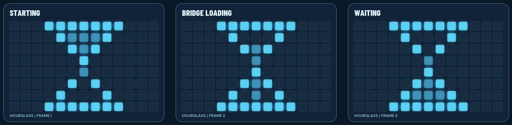
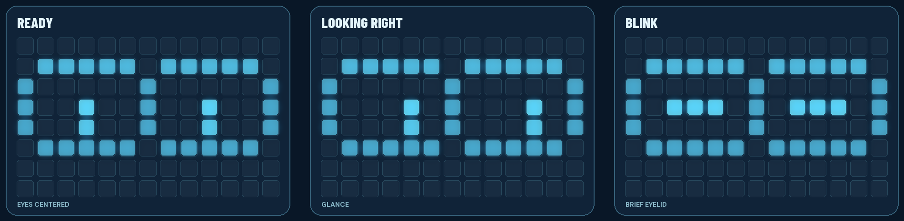
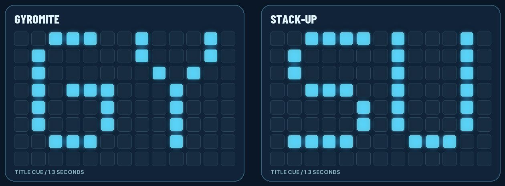
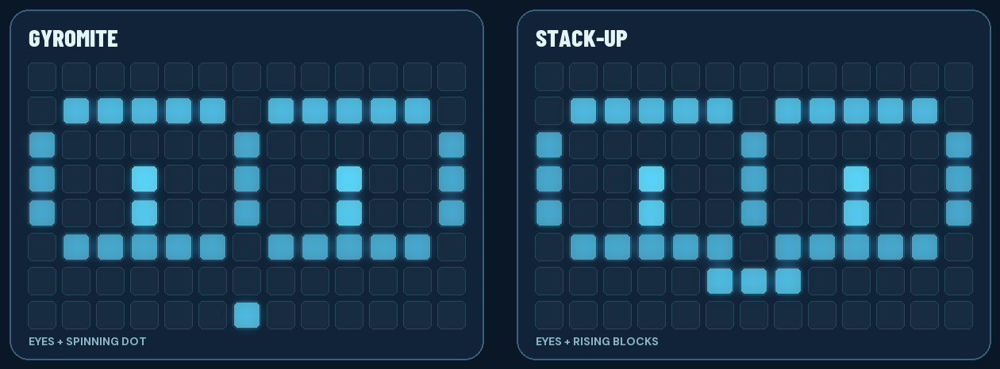
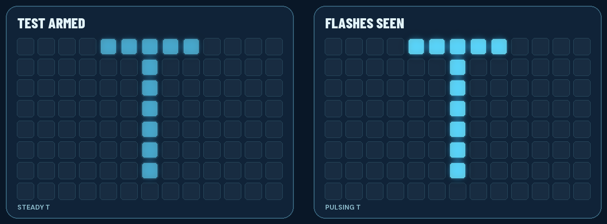
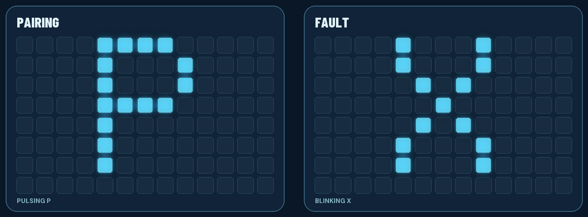

# UNO Q matrix display design

**Status: implemented in the R.O.B. Vision App Lab sketch and Linux bridge; physical display behavior still needs direct visual confirmation.** RetroPie pairing code is generated on RetroPie and entered on the browser Setup page. The UNO Q matrix shows a pairing cue only. This guide defines the behavior for the built-in 13-column by 8-row blue LED matrix. The large browser dashboard remains the place for the full R.O.B. animation, accessories, and explanations.

These images show the 13×8 display states defined in `sketch/sketch.ino`. Each panel is one frame of an animation.

## The animations

**Starting and reconnecting.** Three hourglass frames repeat until the controller is ready.

**Ready, glance, blink.** The eyes move slowly while R.O.B. waits for a game.

**Game selected.** A brief title cue identifies the game; the eyes then return with a small decorative accent. The accents do not indicate a physical gyro or block movement.

**Setup and faults.** The T is steady when Test is armed and gently pulses after sustained flashes are detected. P pulses during pairing; X blinks for a fault.

## What people should see

| State | Matrix | Meaning |
| --- | --- | --- |
| Board power-on, before our sketch runs | Arduino's own boot graphics | System startup; R.O.B. Vision cannot own the matrix yet. |
| R.O.B. Vision sketch starts | VirtualGlove-style pulsing hourglass | The app and Linux side are starting. Begin it as early as the platform permits, before waiting for Router Bridge setup. |
| Linux bridge connects but the controller is still starting or reconnecting | The same hourglass, restarted or continuing smoothly | The bridge is available; the controller has not yet reported ready. A bridge connection alone must not imply game readiness. |
| Controller ready, no game selected | A pair of curious R.O.B. eyes: slow left/right glance and occasional blink | R.O.B. is awake and waiting for a game. This is an attract animation, not proof that a game is linked. |
| Gyromite selected | Brief `GY`, then eyes with a small spinning-dot accent | The selected game is Gyromite. The accent is decorative; it must not claim a gyro is actually spinning. |
| Stack-Up selected | Brief `SU`, then eyes with a small rising-block accent | The selected game is Stack-Up. The accent is decorative; it must not claim a block was moved. |
| Valid movement command accepted | Eyes glance in the movement direction, rise/fall for vertical motion, or narrow briefly for grip | Mirror the authoritative virtual action, then return to the selected game's eye loop. Never animate from an undecoded flash alone. |
| Game Test check armed | Large `T` | The user is checking the game Test signal. The browser separately indicates whether Test flashes were actually detected. |
| Test flashes detected | `T` gently pulses | The frame link has reported the game's Test signal. |
| Pairing in progress | Large `P` with a slow pulse | Open the browser Setup page and read the pairing code and fingerprint shown on RetroPie. Do not show invented or unrelated digits on the UNO Q. |
| Controller fault | Blinking `X` | Open Setup for the actual problem; the matrix alone cannot explain it. |
| App stopped | Matrix released/blank as the platform permits | R.O.B. Vision is no longer driving the display. |

The face should be drawn for the physical 13×8 grid, with two distinct eyes and enough dark space to make a blink or sideways glance readable. The blue LEDs are monochrome: eye shapes and brightness, not color, carry the expression. Limit idle motion to an occasional glance or blink so it feels alive without competing with the game. Show `GY`/`SU` long enough to identify the title, then let the eyes take over. A brief repeat of the title mark after a long idle period is acceptable.

## State ownership and priority

The sketch owns all framebuffer writes and animates the startup hourglass without waiting for Linux. Linux sends compact *requested states* and accepted action hints through Router Bridge, using the UNO Q controller's authoritative game, frame-link, test, and fault state. It sends a heartbeat at least once per second. If Linux disappears for about 3.5 seconds, the display returns to the hourglass rather than freezing a misleading game face. The sketch cannot replace Arduino's protected boot logo before App Lab releases the microcontroller.

Display priority: **fault → pairing → Test check → startup/reconnect → selected game → idle eyes**. A movement hint is temporary within the selected game and never overrides fault, pairing, or Test. Frame-link status is visible on Setup; the idle eyes alone do not claim a linked game. Pairing has a bounded lifetime and returns to the prior state when complete or expired.

## Pairing distinction

VirtualGlove has a separate physical pairing display for its own device approval PIN. R.O.B. Vision pairs **RetroPie to the UNO Q**: RetroPie produces a six-digit code and certificate fingerprint, while the UNO Q browser Setup page accepts them. The matrix `P` is a status cue when **Pair another console** is opened or pairing is submitted; it expires or clears afterward. Showing the code on the UNO Q would require a deliberate change to the pairing protocol.

## Physical acceptance checks still needed

1. Cold boot shows the protected system graphics, then the hourglass as soon as the R.O.B. Vision sketch can run; the hourglass remains through Router Bridge initialization.
2. When the Linux controller is ready, the hourglass changes to the idle eyes. Stopping/restarting Linux restores the hourglass and then the correct current game display.
3. Real Gyromite and Stack-Up launch/exit notifications select and clear their distinct marks and eye loops.
4. Test `T`, pairing `P`, and fault `X` follow the priority and timeout rules. No matrix state claims a Test signal or game action that the controller has not observed.
5. Verify brightness and animation are comfortable beside the game display.
