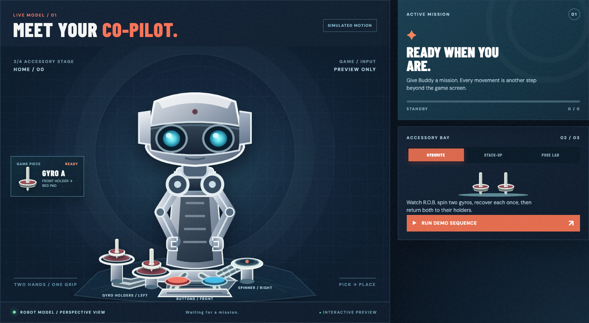

# R.O.B. Vision user guide

The UNO Q hosts Buddy, our virtual robot companion, and receives Gyromite and Stack-Up commands through RetroPie's game-frame link. The robot, gyros, blocks, trays, and spinner are graphics and software state. There is no physical robot or camera. [Meet Buddy](MEET_BUDDY.md) introduces his story; the instructions below describe the working controls.

## Open R.O.B. Vision

Start **R.O.B. Vision** in UNO Q App Lab, then open `http://arduiain.local/dashboard/` on a laptop, phone, or tablet. Stop VirtualGlove first if it is running; this UNO Q runs one App Lab app at a time. The direct `http://arduiain.local:8766/dashboard/` address reaches the same controller. A `file://` page is an offline preview.

Mission shows R.O.B., Accessory Bay, Game Table, Pose Preview, System Vitals, and Activity Feed. **GYROMITE / CONNECTED** means the browser reaches the UNO Q with Gyromite selected. **RETROPIE ONLINE** means the receiver has contacted the UNO Q recently. **GAME FRAMES LINKED** means the selected game is sending its rendered frames.

## Try a demonstration

When no supported game is running, select **Gyromite** or **Stack-Up** and **Run Demo Sequence**. Gyromite demonstrates a held unspun gyro, two spinning gyros on pads, spin-down, re-spin, and return to holders. The illustrative spin clock is 55 seconds. Stack-Up moves red alone and then a blue/white group. **Home** resets the pieces. Pose Lab is a character-only movement sandbox. A live game launch stops the demo and selects that game's scene.

## Choose an NES emulator

For automatic R.O.B. movement, select **lr-robvision-fceumm** or **lr-robvision-nestopia** for the game in RetroPie. Each entry uses the corresponding installed original core and forwards the game's rendered light cells to the UNO Q. The plain **lr-fceumm** and **lr-nestopia** entries play normally without the R.O.B. Vision frame link. Gyromite and Stack-Up currently default to the FCEUmm choice on the test RetroPie. See the [RetroPie setup guide](../deploy/retropie/README.md).

## Play Gyromite

Open [Setup](../dashboard/setup.html) to check RetroPie and game-frame status. Start Gyromite and watch Mission for **GAME FRAMES LINKED**. R.O.B. follows complete commands from the game. A spinning virtual gyro on a pad keeps its gate pressed while R.O.B. moves elsewhere; an unspun gyro can press one gate while held there. The UNO Q sends those pad states to RetroPie's virtual Controller 2.

**Fast Gates** responds immediately while Gyromite is selected. Tap **Lower Blue** or **Lower Red** to press, tap again to release, or choose **Release Both**. Keyboard shortcuts are **2**, **1**, and **0**. Holds expire after 60 seconds; both buttons release on game exit or lost receiver data. If regular controls moved a gyro, use **Home** to restore its holder before Fast Gates. Both gate colors have been verified in Game A under FCEUmm. The game screen remains the authority for Hector's position and gate animation.

## Play Stack-Up

The live model begins with five colored blocks on Tray 3. In Direct mode, jumping Hector onto a command tile sends **Left, Right, Up, Down, Open,** or **Close** through the frame link. Manual controls use the same virtual model. A lower grip carries the contacted block and all blocks above it. Impossible moves are rejected and leave pieces in place. **Home** restores the initial stack. The model does not score the game or initialize Bingo's distinct historical layout. Stack-Up has no Gyromite-style Controller 2 gate return.

## Test mode and reset

Launch the game through its R.O.B. Vision emulator choice and enter Test mode. The game-frame link makes R.O.B.'s red light blink automatically on Mission and Setup when it recognizes the Test signal. A separate ready-light command makes the light steady briefly. Exiting Test mode returns the UNO Q matrix to the game's eyes. Neither signal moves R.O.B. **Preview Red Light** on Setup demonstrates the animation without claiming a game signal.

**Home** resets the selected virtual game. Live **Emergency Stop** clears the game selection; in the offline preview it cancels the script until reset. A browser reload restores the UNO Q's current snapshot. See [Setup](SETUP_GUIDE.md), [gameplay](GAMEPLAY_GUIDE.md), and [troubleshooting](TROUBLESHOOTING.md).
