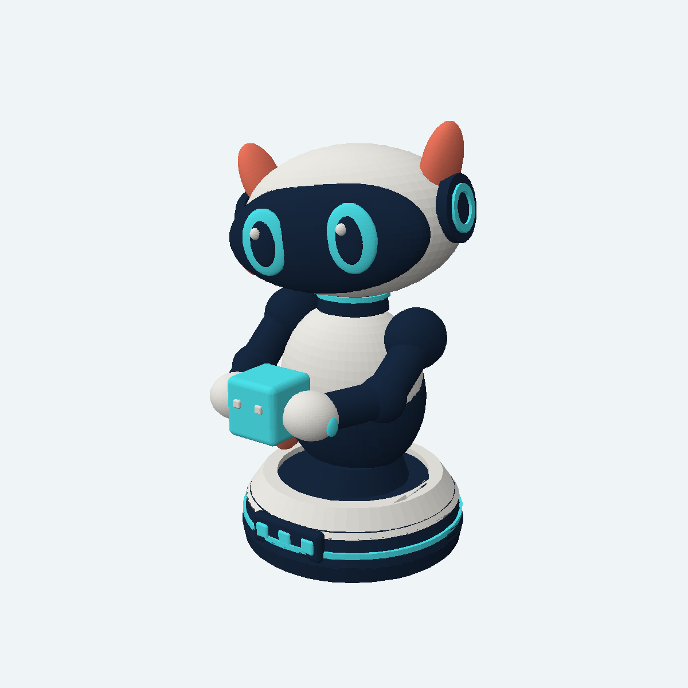
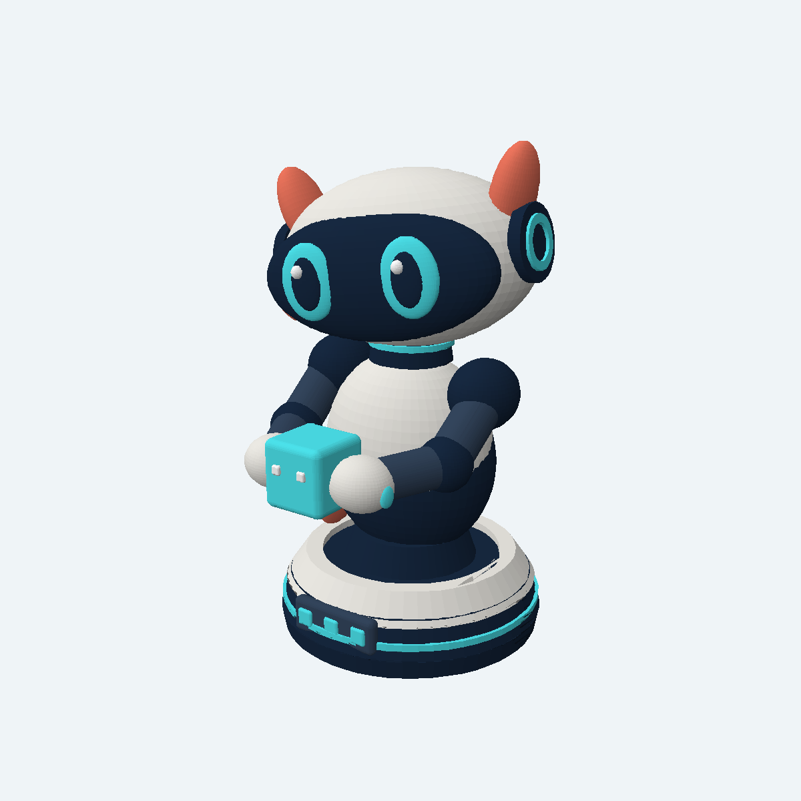

# Print Buddy

Buddy is the original R.O.B. Vision companion, modeled here as a small desk figure holding a game block. The mesh is approximately **81 × 90 × 138 mm** (width × depth × height) and sits flat on its circular base.

| Four-color print | Six-color print |
| --- | --- |
|  |  |

## Files

- `Buddy.stl` — one-piece mesh for a single-color print or painting.
- `Buddy-4-color.3mf` — four separate color volumes: ivory shell, deep navy, cyan, and coral orange. White eye/block details use ivory; lighter navy arm details use deep navy.
- `Buddy-6-color.3mf` — six separate color volumes: ivory shell, deep navy, lighter navy, cyan, coral orange, and white.
- `Buddy.3mf` — compatibility copy of the six-color version.
- `Buddy.scad` — editable OpenSCAD source, in millimetres.
- `parts-4/` and `parts/` — the four- and six-color volumes as individual STLs, for slicers that prefer manual multipart assembly. Keep their original coordinates and align their origins when importing.
- `build.py` — regenerates all STLs and 3MFs from `Buddy.scad` using OpenSCAD.

## Suggested FDM setup

Place the base flat on the build plate. Start with a 0.4 mm nozzle, 0.2 mm layers, three walls, and 10–15% infill. Add supports from the build plate beneath the visor/head overhang, arms, hands, and held block; organic/tree supports should make removal easier. Preview the sliced layers to confirm support touches those overhangs and the small orange fins. A brim may help if your printer has bed adhesion trouble.

Each 3MF is an assembled multipart model, not a pre-sliced printer job. Use your own printer and filament settings. All four and six color volumes were checked for closure, and each set's combined volume matches the one-piece STL. Buddy has **not yet been physically test printed**.

To change Buddy, edit `Buddy.scad` and run `python3 build.py`. Keep the base on the build plate (minimum Z = 0 mm).
